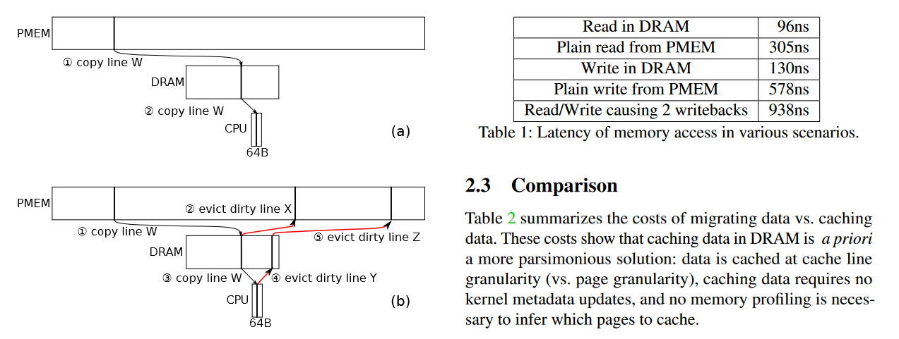
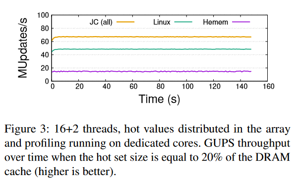

# Johnny Cache: the End of DRAM Cache Conflicts (in Tiered Main Memory Systems)

## motivation

在层次存储中，通常有不同速度的存储介质，如 DRAM 和 PMEM/SSD。此时有两种方式来结合它们：

- 硬件形式，把 DRAM 用作 PMEM 的 cache，即 DRAM 被 PMEM 的内容包含，每次换入一个页时会覆盖掉一个页。

- 软件形式，DRAM 与 PMEM 的内容完全不相交，每次换入一个页时会换出另一个页。

之前的工作认为硬件形式效率低下（如图，最多导致两次写回，时间是直接读 DRAM 的 10 倍）

**右边图可能有用顺便存一下，是随机 8B 读写的时间。**

而软件形式的粒度太大，必须以页为单位换入换出。而硬件形式不存在“换出”只有写回，可以以 64 B 的粒度换入。这实际上是更上面一层缓存行的粒度。

> 粒度太大的本质是，如果 DRAM 与 PMEM 的内容不相交，那相当于它们放在同一个 memory tier。因为它们需要支持同大小的换入换出，因此只能遵循两种存储中更大粒度的那个。

## solve

使用硬件形式，想办法改进缓存分配算法以减少冲突，也就减少了写回的次数，从而能达到更高的效率。

算法设计分两种策略：

- static policy：DRAM 中每个页作为一个 cache bin，每个页里可以放若干缓存行。那么每次要分配时就找最“空”的 cache bin 往里塞。

- dynamic policy：动态在各个页之间调换缓存行。实际效果没有 static policy 好

### evaluation

比 linux 高 20%

### 总结

硬件形式（把 DRAM 用作 PMEM/SSD 的 cache，没有“换出”只有写回）比软件形式（使用换入换出）更好，因为硬件形式可以使用小得多的缓存行，粒度更小。

硬件形式的写回代价大，本文通过算法尽可能平衡使用了各个缓存行，减少了写回的概率，因此得到性能提升
