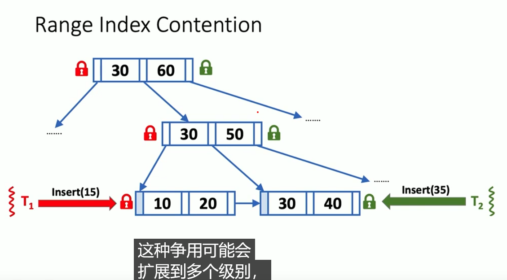
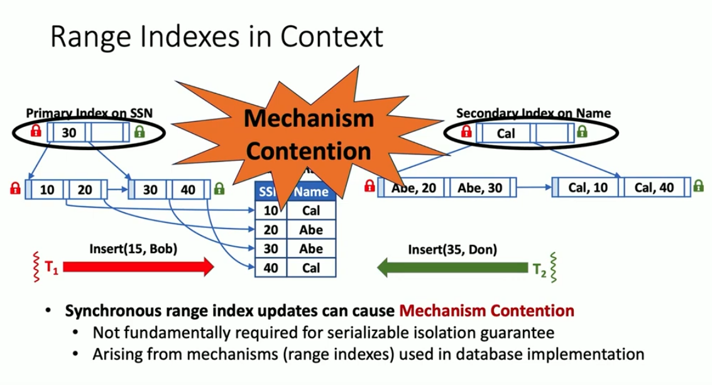
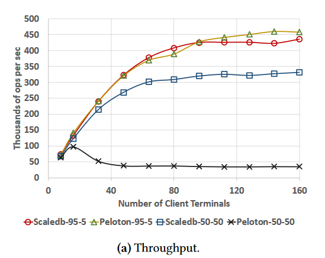
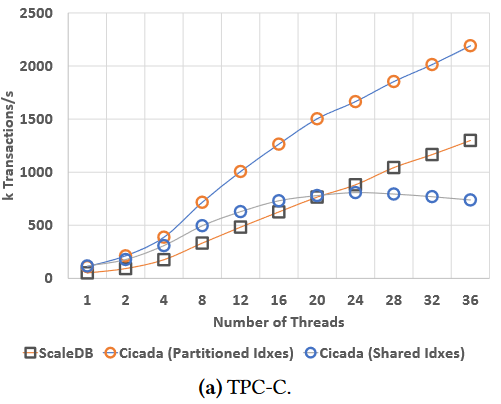

# ScaleDB: A Scalable, Asynchronous In-Memory Database

## background

in-memory 数据库，多核

传统模型：关系型数据库，所有表项按 `Primary Key` 顺序排。允许有除了 `Primary Key` 之外的索引。

支持单点读、单点写、范围读。支持 transaction。

## motivation

在 in-memory 的数据库中，可扩展性(scalability)不足，即在写密集或者读写相当的情况下，不方便扩展到多核，锁不够好。

使用范围索引的数据结构难以扩展多核：

- 在高竞争环境下，`B+Tree/ART/MassTree/BwTree/OpenBwTree`表现都不好

本质问题是，分层的数据结构对写不友好，不方便扩展多核。虽然所有的读可以并行，但一旦出现写，就会立即退化成单核。但如果想保留范围读的能力，又必须用分层的结构。

为什么？

如图，两个线程都需要插入 B+ 树，此时两边的结点都满了，于是需要锁父亲结点。一旦出现这种情况，锁就会向上传播到树根，从而每个线程都在抢树根的修改。

但事实上一些插入是不需要保序的。如这里 15 和 35 其实可以以任意顺序插入，只是使用范围索引的数据结构自己要一条条插入，导致了锁的竞争。作者称为机制导致的竞争（下图）

 

### solve

1. 在 B+ 树（或者`ART/MassTree/BwTree/OpenBwTree`）外加一个哈希表，称为 `indexlet`。写入只写到哈希表，然后每隔一段时间以 batch 形式将哈希表内数据更新到 B+ 树中。

这样写入和单点读都是纯异步的，而且可以任意增加并行的线程数。

2. 给每个索引表外加一个哈希表，称为 `phantomlet`。每次写入时，计算本该插入的叶结点，然后以这个结点的地址为 `hash` 值，插入 `phantomlet`。

因为范围读操作总会去遍历所有它需要的叶结点，所以可以让它读完之后，检查经过的每个叶结点， `hash` 看一下 `phantomlet` 里有没有东西。有则说明存在还在 `indexlet`里没更新到 B+ 树上的写入，此时这个范围读失败。

> 范围读失败不代表数据库出错，只是它想要读的信息还没被正式插入 B+ 树。晚一些读就好了，会有一定性能损失。作者在 evaluation 里说范围读失败的次数<3%。

异步可能导致的问题

- write-after-write 依赖。在实现上，上面所有哈希表和 B+ 树本体的结点都带一个时间戳，这样写操作时如果发现自己比已有的写入的时间戳还要早，就跳过

- 其他同步问题没细看

### evaluation

只取一小部分结果分析。

读：写=95 : 5时，本文 Scaledb 和 baseline Peloton 都很快。读：写=50：50时，本文是 baseline 的 9.5 倍

多核情况下，本文比全局共享索引的 cicada 效果好，比把索引分块分别存的 cicada 效果差。不过后者实际上要求范围读只在小范围内（且最好落在块内）才有这么高的性能，但本文算法支持任意的范围读，都可以并行处理。

> 这里其实没有作者说的提升那么高。因为范围读操作默认就需要枚举范围中的每一个数据，所以不管算法好坏，跨度很大的范围读所耗费的时间就是会很长。所以跨度很大的范围读很可能不能弥补本文算法与 partitioned idxes cicada 的差距。

### 总结

对于写密集或者读写相当的 in-memory 数据库，可以通过在 B+ 树上外加哈希表的方式，获取超高性能的多核并行单点读单点写。

当然，这会适当牺牲范围读的性能，但可以退一步，只判断范围读的对不对，如果不对就过一会再读就行，对于本文用的测例集来说，这种情况<3%。

核心思路是如果不同操作有不同的最低开销（如范围读>单点读≈单点写），就把瓶颈转到最低开销大的操作上，给它更低的优先级
