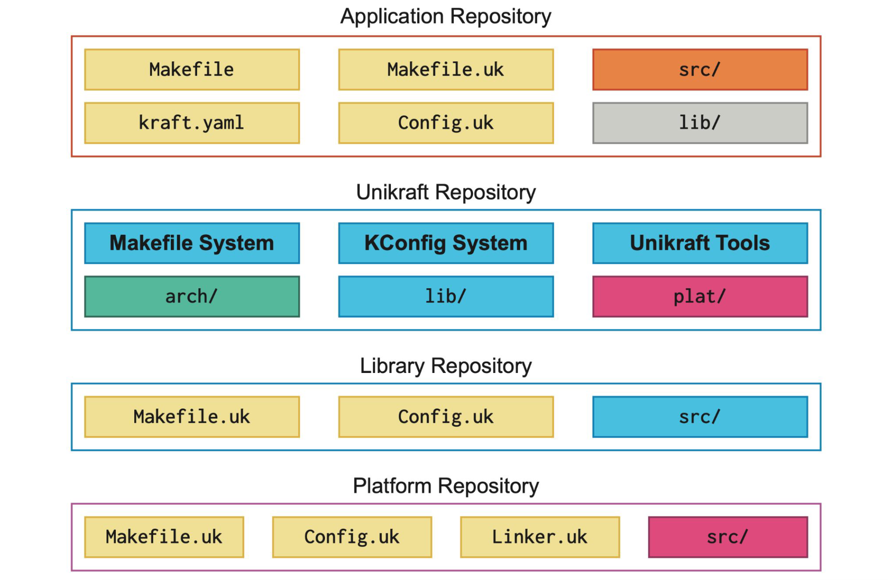
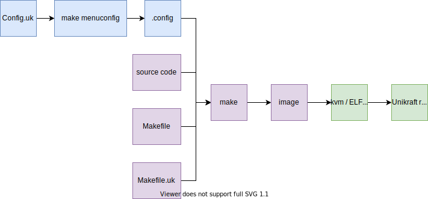
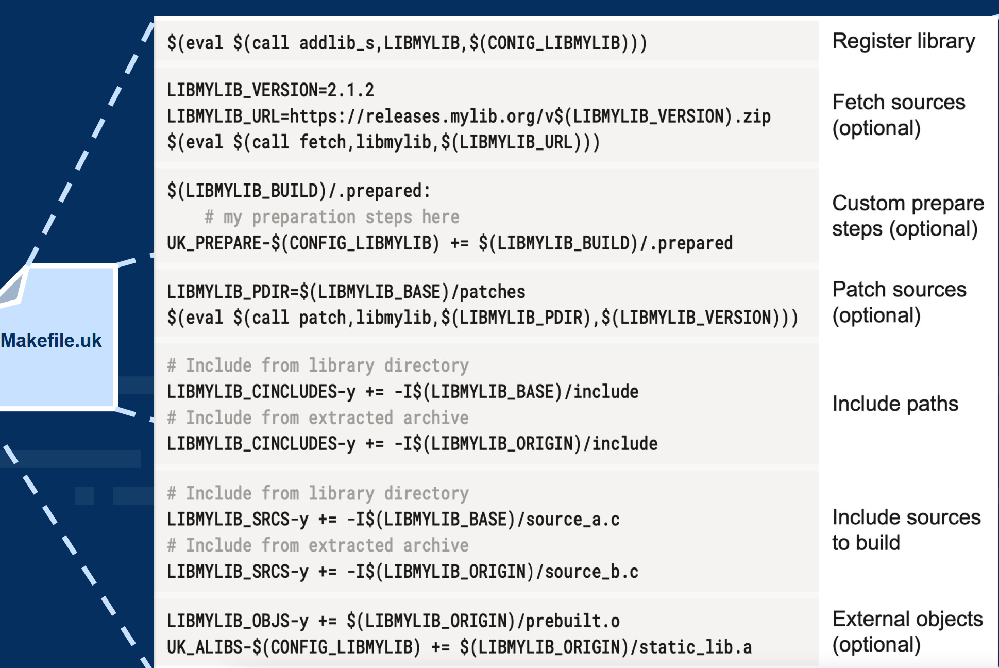
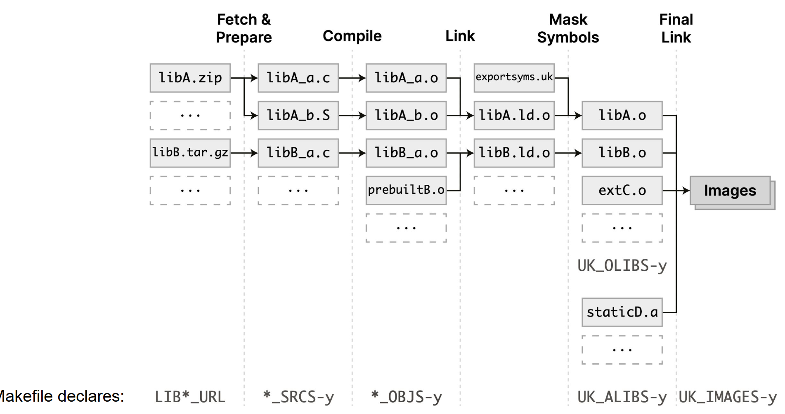

# Unikraft 学习 - 架构和启动过程

[TOC]

### 库的划分

> “Everything is a library”

- 应用库：即利用 `unikraft` 提供的库实际开发和生成最终 img 的库

- `unikraft` 仓库：`lib/`提供了OS内部的通用模块（fs / signal / socket / blockdev 等），`arch/` 和 `plat/` 分别提供了不同架构和平台的支持，其他三个提供了配置构建一个 unikernel 的方法

- Library 库：外部库，可以通过 `Config.uk` 设置一些选项，通过 `Makefile.uk` 告诉 `unikraft` 需要添加哪些代码

- Platform库：目标平台(`Xen / KVM / Linux user-space`)也是一个模块，如果你想添加这样的模块则需要额外提供 `linker`



例：[GitHub - unikraft/lib-redis: Unikraft port of Redis in-memory data structure store](https://github.com/unikraft/lib-redis)

 [GitHub - unikraft/app-redis: Redis on Unikraft](https://github.com/unikraft/app-redis)

### 配置机制

实际上有两套机制，一套是抛开 `kraft`的库管理，完全靠 C 和 Makefile 实现的

一套是通过 `kraft` ，一个 `python`写的包管理工具，用 `kraft.yaml` 替代了部分 `Makefile.uk / Config.uk` 的工作，但也可以和上述机制同时存在

### Config.uk

每个模块都可以有一个，但不必要。这个文件的解析由 `unikraft/Makefile` 中转发给 `unikraft/support` 中各种脚本实现，底层是一个现成的工具 `kconfig`。

一个例子：`unikraft/lib/vfscore/Config.uk` 的一部分

```context
config LIBVFSCORE
    bool "vfscore: VFS Core Interface"
    default n
    select LIBNOLIBC if !HAVE_LIBC
    select LIBUKTIME if !HAVE_LIBC
    select LIBUKDEBUG
    select LIBUKLOCK

if LIBVFSCORE
menu "vfscore: Configuration"

config LIBVFSCORE_PIPE_SIZE_ORDER
    int "Pipe size order"
    default 16
    help
        The size of the internal buffer for anonymous pipes is 2^order.
......
config LIBVFSCORE_ROOTFS_INITRD
        bool "InitRD"
        select LIBRAMFS
        select LIBUKCPIO
```

#### config 如何引入代码？

每个模块的 config 会被 `kconfig` 整合成一个 `.config` 文件，然后**在 build 时**，会在 `build/include.uk/_config.h` 中自动生成对应的宏，但是会加上 `CONFIG_` 前缀

在代码中会直接使用这个宏，如上面的`Config.uk` 中的 `LIBVFSCORE_ROOTFS`，在 `_config.h` 中会被生成为 `CONFIG_LIBVFSCORE_ROOTFS_INITRD`，然后在代码中可以按照`#ifdef` 等方式使用，也可以直接用：

```c
static const char *rootfs   = CONFIG_LIBVFSCORE_ROOTFS;
```

> 这些 config 虽然类似 rust crate 的 feature，但是是可以（并且在代码中也经常）跨模块跨库引用的



### Makefile.uk



 

### 外部依赖

- 通过 `Config.uk` 之间的联动来实现。例：`unikraft/lib/Config.uk` 与 `unikraft/lib/uksched/Config.uk`

- 通过 `exportsyms.uk` 

### kraft

- 可以一定程度上替代`Makefile / Makefile.uk`

- 通过 `kraft.yaml` 一定程度上替代 `Config.uk`去生成 `.config`。选择目标平台比较方便，但选择子模块的选项还是太麻烦

- 通过建立 `.unikraft` ，利用 git 在里面对不同的外部库和 app 进行管理，同时联动`kraft.yaml`。这一点已经有点类似 `.cargo`了。

- 可以在生成后提供一些预设脚本。例如在生成`qemu / KVM` 镜像后可以有 `qemu-guest` 作为运行脚本


